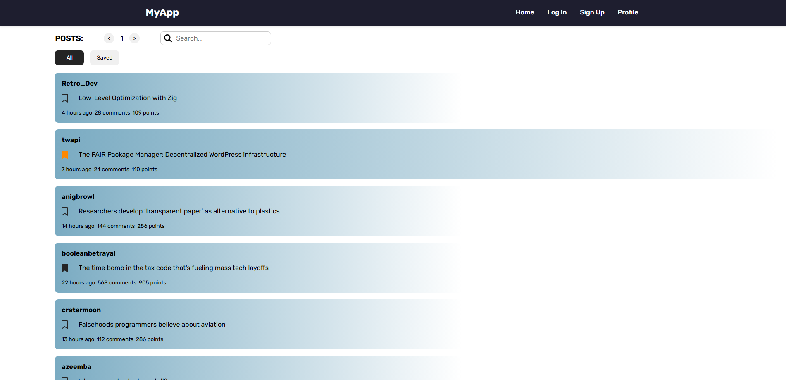

# 🕸️ Hacker News Scraper API

This is an **asynchronous web scraping API** for [Hacker News](https://news.ycombinator.com), built with **FastAPI**. It fetches post data (title, points, author, comments, etc.) from one or multiple pages, using **concurrent requests**, **HTML parsing with BeautifulSoup**, and **caching** to improve performance.

## 🚀 Features

- ⚡ Asynchronous scraping for fast performance
- 🔁 Retry mechanism (via [Tenacity](https://tenacity.readthedocs.io/)) to handle connection issues
- 🧠 In-memory page caching to avoid redundant requests
- 🧪 Tests using `pytest` and `pytest-asyncio`
- 🐳 Dockerized with `docker-compose`

## 📦 Project Structure

```
.
├── app
│   ├── main.py                  # FastAPI app entry point
│   ├── routes/
│   │   └── scraper.py           # API routes
│   └── services/
│       └── scraper_service.py   # Scraping logic
├── tests/
│   └── scraper_test.py          # Tests for scraping logic
├── Dockerfile
├── docker-compose.yml
├── requirements.txt
└── README.md
```

## 🐳 Running with Docker

```bash
docker-compose up --build -d
```

The API will be available at: [http://localhost:3000](http://localhost:3000)  
API docs with Swagger available at: [http://localhost:3000/docs#/](http://localhost:3000/docs#/)
## 🔍 API Endpoints

| Method | Path                 | Description                         |
|--------|----------------------|-------------------------------------|
| GET    | `/`                  | Get posts from page 1               |
| GET    | `/{page}`            | Get posts from first `{page}` pages |

- Example: `GET /posts/2` returns posts from page 1 and 2 (approx. 60 posts)

## 🧪 Running Tests
```bash
docker-compose run web pytest -s tests/
```

## 💡 Notes

- Caching is in-memory and resets when the app restarts.
- The retry mechanism uses exponential backoff (max 5 attempts) for resilience.

## UI Implementation

Example of how it would look like in a UI  

